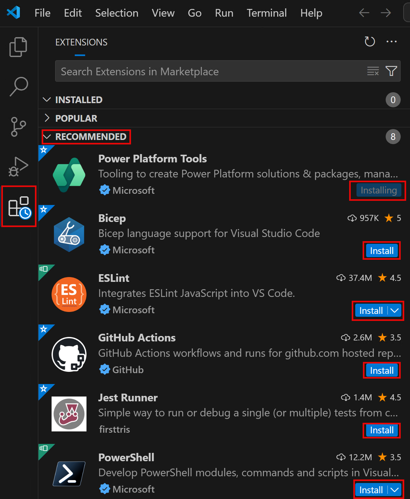
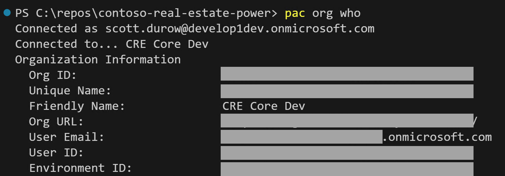
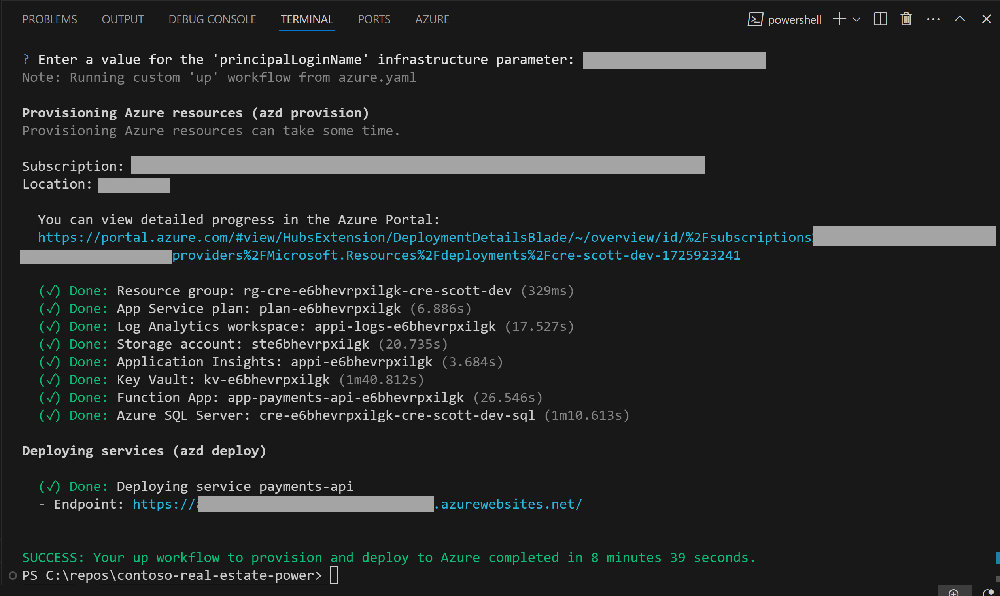

#  Contoso Real Estate Development Environment Full Setup

These instructions guide you through setup, building, and deploying the Contoso Real Estate Solutions. These instructions assume that:

1. You are using a Microsoft Windows 11 workstation with Administrative rights to install programs.
1. You have access to an Azure Subscription with a user that has Entra ID administration rights.
1. Your Power Platform tenant is in the same directory as your Azure Subscription.

## ✅Install Visual Studio Community

1. Navigate to [Download Visual Studio Tools - Install Free for Windows, Mac, Linux (microsoft.com)](https://visualstudio.microsoft.com/downloads/) and select **Community** -> **Free Download**
1. **Open** the downloaded `VisualStudioSetup.exe` and follow the instructions.
1. On the **Workloads** tab, select:
   - ASP.NET and web development
   - Azure development
   - Data storage and processing
1. On the **Individual components** tab, ensure the following are selected and add if required:
   - .NET 8.0 Runtime (Long Term Support)
   - .NET 6.0 Runtime (Long Term Support)
   - .NET Aspire SDK 
   - .NET Framework 4.6.2 SDK
   - .NET Framework 4.6.2 targeting pack
   - .NET Framework 4.7.2 SDK
   - .NET Framework 4.7.2 targeting pack
   - .NET Framework 4.8 SDK
   - .NET Framework 4.8 targeting pack
   - .NET SDK
   - Windows 11 SDK (10.0.22621.0)
1. Select **Install**
1. Wait for the install to complete.
1. When prompted to Sign in to Visual Studio, sign in with your Microsoft account if you have one, or select **Skip this for now**
1. Choose your theme (dark is used in these instructions), and select Start.
1. Close the Visual Studio installer window.

> [!TIP]
> If you already have Visual Studio installed you can check the Workloads, and Individual components and add any missing by running the Visual Studio Installer from your start menu.

## ✅Install VSCode

1. Navigate to [Download Visual Studio Code - Mac, Linux, Windows](https://code.visualstudio.com/Download) and select **Windows**
1. Open the downloaded `VSCodeUserSetup-x64-...exe`
1. If you get the message "This User Installer is not meant to be run as an Administrator.", Select **OK**.
1. Select **I accept the agreement** -> **Next**.
1. Accept the default location -> **Next**.
1. Accept the default Start Menu name -> **Next**.
1. Select both of the **Add "Open with Code**" checkboxes -> **Next** -> **Install**.
1. Select **Finish** once completed
1. Open **VSCode** from the start menu.
1. Select your theme. **Dark Modern** is used for these instructions.

## ✅Install Git for windows

1. Navigate to [Git - Downloads (git-scm.com)](https://git-scm.com/downloads) and select **Windows**
1. Select **Click here to download** 
1. Open the downloaded **Git installer exe**.
1. Select **Next**.
1. Accept the default folder location -> **Next**.
1. Select **Add a Git Bash Profile to Windows Terminal** -> **Next**.
1. Accept the default start menu folder -> **Next**.
1. In the **dropdown** select **Use Visual Studio Code as Git's default editor** -> **Next**.
1. Leave the default **Let Git decide** -> **Next** .
1. Leave the default **Git from the command line and also from 3rd-party software** -> **Next**.
1. Leave the default **Use bundled OpenSSH** -> **Next**.
1. Leave the default **Use the OpenSSL Library** -> **Next**.
1. Leave the default **Checkout Windows-style, commit Unix-style line endings** -> **Next**.
1. Leave the default **Use MinTTY** -> **Next**.
1. Leave the default **Fast-forward or merge** -> **Next**.
1. Leave the default **Git Credential Manager** -> **Next**.
1. Leave the default **Enable file system caching** -> **Next**.
1. Leave **Enable experimental support for pseudo consoles** unchecked -> **Install**.
1. Select **Finish** once installed.

## ✅Install the Git CLI

1. Navigate to [GitHub CLI | Take GitHub to the command line](https://cli.github.com/)
1. Select **Download for Windows**
1. Open the downloaded `msi`.
1. Select **Next** -> **Next**-> **Install**.
1. Select **Finish** once installed.

## ✅Install Azure CLI

The Azure CLI (az) is used to perform operations on Azure. The official instructions on installing can be found at [Install the Azure CLI for Windows | Microsoft Learn](https://learn.microsoft.com/en-us/cli/azure/install-azure-cli-windows?tabs=winget)

1. Download the latest x64 installer from [Install the Azure CLI for Windows | Microsoft Learn](https://learn.microsoft.com/en-us/cli/azure/install-azure-cli-windows?tabs=azure-cli)
1. Run the downloaded installer.
1. Alternatively, you can open a terminal using `Windows Key + X` and select **Terminal (Admin)**
1. Then use the following command to install the Azure CLI

```pwoershell
 $ProgressPreference = 'SilentlyContinue'; Invoke-WebRequest -Uri https://aka.ms/installazurecliwindows -OutFile .\AzureCLI.msi; Start-Process msiexec.exe -Wait -ArgumentList '/I AzureCLI.msi /quiet'; Remove-Item .\AzureCLI.msi
```

> [!NOTE]
> The installation may take a few minutes.

## ✅Install Node

The TypeScript components require node to be installed so that they have access to the node run time and the node package manager (npm).

1. Navigate to [Node.js — Download Node.js® (nodejs.org)](https://nodejs.org/en/download/package-manager)
1. Select the **Prebuilt installer** tab and **Download Node.js**
1. Run the downloaded installer.
1. Select Next
1. Accept the agrement - > Next 
1. Accept the default file path -> Next
1. Accept the defaults -> Next
1. Check 'Automatically install the necessary tools'
1. Select Next -> Install
1. Select Finish
1. The **Install Additional Tools** dialog will popup, **press any key to continue**.
1. Various packages will be installed automatically.

## ✅Create a GitHub account

For this workshop, we are going to be using a **GitHub personal** account. If you already have a **GitHub personal** account, you can skip this task and simply login to GitHub.

1. Open [GitHub](https://github.com) in the browser session using the profile you created above.
2. Click on **Sign up** on the top right corner.
3. Enter your email address (Use a personal email address. Do not use your work address or the workshop account) and then click **Continue.**
4. Create a password and then click **Continue.**
5. Enter a username and then click **Continue**.
6. Select whether you want to receive product updates or not and then click **Continue.**
7. Solve the puzzle to verify your account and then click **Create account**.
8. Enter the code that was sent to your email address and then when you've navigated to the welcome screen, click **Skip personalization**.

You now have a GitHub account - ensure you are logged in as your GitHub account in the browser profile that you created earlier. 

## ✅Create a new browser profile (Microsoft Edge)

It's always good to have a separate browser profile for your work and for workshops like this. This way you can keep all of your credentials separate and not have to worry about logging out of your personal / work accounts.

1. Open **Microsoft Edge**.

1. Click on the profile icon (this may be on the top left or top right corner).  

1. It the bottom of the profile list, hover over **Other profiles** and then select **Set up new work profile**.  If there are no existing profiles, simply select **Add new account -> Sign in to sync data**.
   

> [!IMPORTANT]
> Select **Set up new work profile** not **Set up new personal profile**

4. Click **Add**.

   This will then open up a new browser window on your taskbar.

1. In the new browser window, select **Start without your data**.

1. Select either **Allow** or **Don't allow**, and then select **Confirm and start browsing**.

   Edge may prompt you to configure your new browser theme. If this happens, select System default, Light or Dark and select **Next**.

> [!NOTE]
> All the screenshots in these labs are using Dark mode.

7. Select **Finish**.

> [!IMPORTANT]
> Re-open these labs inside the new browser profile window so that any links will open in the correct profile.

## ✅Log in to Power Apps

Using the new browser profile,  log into to Power Apps.

1. In the new browser profile, navigate to [make.powerapps.com](https://make.powerapps.com)

> [!IMPORTANT]
> Make sure you use the new browser profile, instead of an existing profile.


2. Sign in if you are prompted to do so.
   
4. If you're prompted to stay signed in, check **Don't show this again**, and select **Yes**.

5. If asked to choose your region, select **United States** and select **Get started**.

   You should now be logged in and on the Power Apps Home Page.

## ✅Create a developer environment

For this workshop, you will need a Dataverse environment. You can create up to 3 of these for free. Developer environments will be deleted after a period of inactivity.

### 👉Subscribing to the developer plan

You are required to subscribe to the Power Apps Developer Plan to create developer environments that gives you access to all of the Power Platform resources for development purposes. 

To create developer environments, you can create them in multiple ways:

1. Subscribing to the Power Apps Developer Plan.
1. Using the Power Platform Admin Center (PPAC)
1. Using the Power Platform CLI

In this workshop we will use option 1 because it will automatically assign a developer license to yourself, where as the other options do not.

1. Go to the [Power Apps Developer Plan](https://aka.ms/pp/devplan) page (use the Edge profile you created for this workshop).
1. Select **Try for Free.**
1. Enter your username and check the **Agree** checkbox.- > Select **Start free**.
1. Leave the country as United States and select the **Accept** button.  
1. After selecting **Accept**, a Power Platform developer environment will be created for you with the name `[User Name]'s Environment`. You will then be redirected to the maker portal. 

### 👉Create developer environments

2 developer environments are required for the sample.

1. Open the Power Platform admin center https://admin.powerplatform.microsoft.com/
1. Select **Environments** in the left hand menu
1. Select New, and enter `CRE Core Dev (your name)`
1. Choose **United States** as the region. 
1. Select **Developer** as the Type.   
   
1. Select **Next**
1. Select **English (United States)**, and **USD($)**.   
   
1. Select **Save**.
1. Wait for the environment to show as **Ready**
1. Select the **environment**.
1. Select **Resources** -> **Dynamics 365 apps**.
1. Where **Update available** is shown, select the link.
1. Check **I agree to the terms of service**.
1. Select **Update**.
1. **Repeat** for all updates.
1. In the **Dynamics 365 apps area**, select **Open App Source**.
1. Search for Dataverse Accelerator
1. Select **Get it now** on the Dataverse Accelerator Card, and **Get it now** again 
1. Select your development environment, and check '**I agree**' to the two checkboxes.
1. Select **Install**.
1. Repeat to create an environment named `CRE Portal Dev (your name)`.
1. **Wait** until the updates are installed in both environments.

## ✅Fork the Repo

1. Inside GitHub, navigate to the main page of the repository.

1. In the top-right corner of the page, click **Fork**.

1. Select your own account for the Owner of the forked repository.

1. Select **Create fork**.

1. On **GitHub**, navigate to your fork of the repository.

1. Open your new fork of the repo and select, select **Code**.

1. Select the **copy** icon next to the **GitHub CLI** command.
   

1. Open a **new instance** of **VSCode** and  press ```Ctrl+Shift+` ``` to open a terminal window. This should default to **PowerShell**.

1. Change the current working directory to the location where you want the cloned directory.

   ```powershell
   cd C:\repos
   ```

1. Authorize with GitHub using:
   ```
   gh auth login
   ```

1. Select the defaults **GitHub.com**, **HTTPS**, **Login with a web browser**

1. Copy the one-time code and press **Enter**.

1. In the popup browser authentication window, follow the instructions to select your account and **paste the one-time code**.

1. Select **Authorize GitHub** when prompted.

1. Close the browser tab and return to **VSCode**.

1. Paste the `gh cli` command you copied in a previous step.

     ```
     git clone https://github.com/YOUR-USERNAME/YOUR-FORKED-REPO.git
     ```

1. Open the repo using:
     ```
     cd contoso-real-estate-power
     code . -r
     ```

1. Select **Yes, I trust the authors** when prompted.

     

## ✅Install VSCode extensions

1. The repo has a set of recommended extensions.

1. Select the **Extensions** item from the **Activity Bar** on the left

1. Under the **RECOMMENDED** section, select **Install** for the following extensions:

   1. Power Platform Tools

   1. Bicep

   1. ESLint

   1. GitHub Actions

   1. Jest Runner

   1. PowerShell

   1. Azure Tools
   
      

### 👉Authorize the PAC CLI

1. Run the following command at the terminal inside VSCode:

   ```bash
   pac auth create
   ```

> [!NOTE]
> If you see an error then close any existing terminals and open a new one using ```Ctrl+Shift+` ```
   
2. **Login** with your **Power Platform environment developer account** that you used previously to create your developer environments.


1. If you see a **Pick an account** screen, select your workshop user which should say *Signed In* next to it.

1. You will then see a page asking if you're trying to sign in to Power Platform CLI - pac.  

1. The Code space terminal should show the message **Authentication profile created** showing the workshop user you were provided.  
   

1. At the terminal type `pac auth list`. You will see the new auth profile with an asterisk (*) next to it indicating that it is the currently selected profile. The profiles is created as **UNIVERSAL** meaning that it is not specific to any specific environment.  
   
1. To select our developer environment, expand the Power Platform left panel. If you do not see the **UNIVERSAL** profile, hover over the AUTH PROFILES area and select **Refresh**.

> [!TIP]
> If you do not see the power platform extension logo as in the screenshot below, press `Ctrl + Shift + P`, and then type `Developer: Reload Window` and press `ENTER`.

8. To select our developer environment, use the Star icon **Select Environment**. The Environment then should have a filled star next to it.  
   

1. If you now run `pac auth list` you will see the URL of the environment you have selected listed. The asterisk (*) indicates that this is the currently selected auth profiles if you have multiple different profiles for different tenants. You can switch using `pac auth select --index`  
   
> [!TIP]
> You can also select an environment by using
> `pac org select --environment <URL/ID/Unique Name/Partial Name>`
   
10. To ensure that you are connected to the correct environment, at the terminal type `pac org who`
   This will show the current connection and environment selected.  
   
   
   
   ## ✅Deploy Azure Resources
   
   The Contoso Real Estate (Power Platform Edition) project utilizes several Azure components to enable its functionality. These components include:
   
   1. **Payments API Azure Functions** - This component is used to host the payments api that is used by:
      - **Power Platform Custom Connector** to create a Stripe Checkout session that is called by the portal using a Power Automate Flow. This is used for listing reservations.
      - **Power Platform Custom Connector** to list Payments
      - **Dataverse Virtual Table Provider** C# Plugin to expose the Payments as a Dataverse Virtual Table
      - **Webhook** that is called by Stripe when payments events are raised
   2. **Azure SQL Database** - Stores the payments made via Stripe
   3. **Azure Key Vault** - Used to store all secrets that are necessary and is configured as the backing for Power Platform Environment Variable secrets.
       - `AZURE-SQL-CONNECTION-STRING-payments-api` - SQL connection string for the Payments database. This does not contain any login username or password because the Azure Function uses a Managed Identity to connect to the database. E.g. `Server=tcp:sql-***.database.windows.net,1433;Initial Catalog=contoso-real-estate;`. [Learn about Managed Identities in Azure Functions](https://learn.microsoft.com/en-us/azure/azure-functions/security-concepts)
       - `cre-..-development-payments-api-client-secret`- Custom Connector Client Secret that is referenced by the Power Platform Environment Variable Secret and used in the custom connectors.
       - `StripeApiKey` - The Stripe API key to use for payment processing
       - `StripeWebhookSecret` - The Stripe webhook secret to use for verifying webhook events
   4. **Entra ID Application registrations** used to authenticate Power Platform against the Payments API
   
   ### 🦾Deploying Azure Resources
   
   To deploy the Azure resources required for the Contoso Real Estate (Power Platform Edition) project, you can use the `azd up` command. This command is part of the Azure DevOps CLI extension and allows you to define and manage your infrastructure as code.
   
   Here are the steps to deploy the Azure resources using `azd up`:
   
1. Open a PowerShell terminal window inside VSCode at the root of the cloned repo.

1. Ensure the Azure CLI by following the instructions provided in the [official Azure CLI documentation for your operating system](https://learn.microsoft.com/en-us/cli/azure/install-azure-cli). You can check the installation using at the VSCode powershell terminal:

    ```powershell
    az version
    ```

1. Log in to your Azure account by running the following command and following the prompts:

    ```powershell
    az login --use-device-code
    ```

    Copy the code shown, open the browser profile window you created, and navigate to https://microsoft.com/devicelogin.

    Enter the code and select Next. Select your login and select **Continue**. Close the browser window once you have signed in.
   
 > [!NOTE]
 > If you have multiple tenants, you may need to also provide the --tenant parameter. 
   
3. After successfully logging in, select the subscription you would like to deploy into.

    If you have previously logged in, you can view the subscriptions and select one using:

    ```powershell
    az account list --output table
    az account set --subscription <Subscription Id you wish to use>
    ```

1. You must be a member of the **User Access Administrator** and **Key Vault Administrator** on your subscription to manage the access control on a key vault.

    ```powershell
    # Set the subscription and user principal name
    $subscriptionId = az account show --query id --output tsv
    $currentUPN = az ad signed-in-user show --query userPrincipalName
    
    # Find the roles of the current user for the currently selected subscription
    az role assignment list --query "[?principalName=='$currentUPN' && scope=='/subscriptions/$subscriptionId'].roleDefinitionName" --output table
    ```

    If you do not see the two roles `Key Vault Administrator` and `User Access Administrator`, then use the following:

    ```powershell
    # Assign the "Key Vault Administrator" and "User Access Administrator" role to the user
    az role assignment create --role "Key Vault Administrator" --assignee $currentUPN --scope /subscriptions/$subscriptionId
    az role assignment create --role "User Access Administrator" --assignee $currentUPN --scope /subscriptions/$subscriptionId
    az role assignment create --role "Key Vault Secrets User" --assignee $currentUPN --scope /subscriptions/$subscriptionId
    ```

1. The Power Platform Resource Provider must be registered in your Azure subscription so that Dataverse can access Azure Key Vaults in that subscription. At the VSCode PowerShell terminal, use:

    ```powershell
    az provider register -n Microsoft.PowerPlatform
    az provider show -n Microsoft.PowerPlatform --query "registrationState"
    ```

    Registration will take a few minutes.

1. Ensure your terminal has the repo root as the current directory.

1. Install the Azure DevOps CLI extension by running the following command:

    ```powershell
    infra\azd\install-azd.ps1
    ```
      
 > [!NOTE]
 > You must close and re-open all instances of VSCode. Use `azd version` at the VSCode terminal to ensure you have `azd` installed.
      
8. Install bicep using:

    ```powershell
    az bicep install
    ```

> [!NOTE]
> Check you have the latest version of Bicep (>= 0.29.47) installed using `az bicep version`. Bicep is located in your azd bin folder `%USERPROFILE%\.azd\bin`

9. Run the `azd up` command to start the deployment process:

    ```powershell
    az extension add --name graphservices
    azd up --environment development
    ```

    The `environment` parameter would normally be the Power Platform environment that is being deployed to e.g. `elaiza-dev1` `UAT` `PROD`

1. When asked if you want to create the Environment, press 'Y'.

1. Select the Subscription to use when prompted.

1. Select the location to use - e.g. Central US
      
> [!IMPORTANT]
> When selecting a Azure location to deploy into, avoid using **WEST US 2** due to there often being resource capacity limitations.
   
13. When prompted for the 'principalLoginName' infrastructure parameter, enter your Power Platform username e.g. `some.user@myenvironment.omicrosoft.com`. This will be stored in a file called `.azure/<environmentname>/config.json`. It is important to ensure that this user name is the one you have authenticated against Azure with. It will be used to set the administrator of the SQL Server.

> [!NOTE]
> If you want to deploy updates to the code later on after the infrastructure has been published you can use `azd deploy`

14. Monitor the deployment progress and check for any errors or warnings. The `azd up` command will provide detailed logs and feedback during the deployment process.
      
> [!NOTE]
> You may need to run `azd up` a second time if there are errors the first time (due to azure replication)
      

   

## 📜Post deployment steps

Some settings cannot be performed by Bicep/ARM scripts (or are complex and beyond the scope of this sample). To complete the deployment the following tasks must be carried out:

- Grant the Azure Function Payment API managed identity access to SQL Server. The Azure Functions run under a System Assigned Managed Identity (SAMI). This identity must be added to the SQL Server as an external user. This cannot be performed by a SQL Login (inside the bicep script), because it needs access to Entra ID.
- Add admin consent to the Payment API client Entra ID Application registration, so that it can be used as an SPN connection in Power Platform
- Grant your user access to the Payment API so that it can be used as an OAuth user connection in Power Platform for testing.

To perform the post deployment:

1. You will need a stripe account for the payment API to function. You do not need a production account, a developer test account is created for free.
1. Navigate to [Sign Up and Create a Stripe Account | Stripe](https://dashboard.stripe.com/register)
1. Enter you Email, Name, Country, and Password. 
1. Select **Create account**.
1. Validate your email address by following the instructions.
1. Navigate to https://dashboard.stripe.com/test/dashboard

7. Run the following and follow the instructions carefully:

```powershell
./infra/scripts/post-deployment-setup.ps1
```

Enter the environment that you deployed using azd. If you have deployed multiple times with different names, then you must pick the one you are setting up.

## ✅Deploying Core Development Solution

The Core development environment has the custom controls solution deployed as managed, and the Core solution deployed as unmanaged to enable it to be worked on.

1. Using the Power Platform Developer Tools in VSCode, select the environment you wish to deploy to. You can see which environment you currently have selected by using:

   ```powershell
   pac env who
   ```

1. Inside **VSCode**, drag the script located at `src\core\solution\deployment-scripts\1-deploy-to-development-environment.ps1` into the PowerShell terminal window, and press **Enter** to execute it

1. Follow the instructions when running the script carefully. You will need to select the Azure environment that you deployed using azd up, then download the `ContosoRealEstateCustomControls_managed.zip` solution into the `temp_releases` folder using the path given.

> [!NOTE]
>
> If you receive the error `SignTool.exe not found`, then ensure you selected the `Windows 11 SDK (10.0.22621.0)` additional install when installing **Visual Studio**.

## ✅Core Post Deployment Steps

There are some manual tasks that cannot be performed during solution deployment after you have run the `azure-api` installation procedure and deployed to your development environment:

- Reply URLs added to the Payments API Entra ID application registration to match the custom connectors
- Update the Plugin Managed Identity to match your azure deployment

Run the following PowerShell and follow the instructions carefully:

1. Drag the script located at `src\core\solution\deployment-scripts\2-post-deployment-setup.ps1` into your VSCode terminal window and press **Enter**.
1. You will be prompted to open the 2 custom connectors and copy the Reply Urls so that they can be added to the Entra ID application.
1. You will be asked if you would like to update the managed identity settings. This will configure the virtual entity plugin to connect to the Azure API.

## ✅Deploying the Portal Development Solution

The source for the Portal solution is built using:

- Power Pages
- Power Apps Component Framework
- Copilot Studio

When working on this solution, it must be deployed to a separate environment that has the CustomControls and Core solutions installed as a managed solution.

The following tasks must be carried out before you import that `ContosoRealEstatePortal` solution

### 🤖Turn off Automatic Copilot Creation for Power Pages

When a power pages site is created, by default a new Copilot will be created and the `SiteComponent` with type `BotConsumer` will be updated to point to the new copilot. This interferes with the CI/CD process. As a work around the the `enableChatbotOnWebsiteCreation` Tenant setting should be turned off using the Power Platform admin PowerShell:

```powershell
# Install the Power Platform PowerShell Admin commands
# See https://learn.microsoft.com/en-us/power-platform/admin/powershell-installation
Install-Module -Name Microsoft.PowerApps.Administration.PowerShell

# Authenticate
Add-PowerAppsAccount -Endpoint prod

# Update tenant settings
$requestBody = @{
        powerPlatform = @{
            powerPages = @{
                enableChatbotOnWebsiteCreation = $false
            } 
        } 
    }

Set-TenantSettings -RequestBody $requestBody
```

For more information, see: https://learn.microsoft.com/en-us/power-pages/getting-started/enable-chatbot

### 👉Deploy to Portal Developer Environment

To deploy the Portal solution, perform the following steps:

1. Ensure you have all the updates installed via the Dynamics 365 apps page in the [admin portal](https://admin.powerplatform.microsoft.com/) for your CRE Portal Dev environment.

1. Inside VS Code, change the selected environment to be your CRE Portal Dev environment by electing the  environment in the Power Platform Developer Tools, or by using `pac env list` and `pac env select -env "CRE Portal Dev (yourname)"`

1. Drag into the terminal the script at `src\portal\solution\deployment-scripts\deploy-to-development-environment.ps1`, press Enter, and follow the instructions carefully.

1. You will be prompted to download the Custom Controls and Core **managed** solutions from the repo and place into the temp_release folder location given.

1. The Portal solution will be built locally

1. The **managed** solutions are first installed, and then the portal **unmanaged** solution is imported.

## ✅Core Post Deployment Set up

To perform post deployment steps, first drag the Core solution post deployment setup script into the VSCode terminal and press Enter.

```powershell
src\core\solution\deployment-scripts\2-post-deployment-setup.ps1
```

This will:

- Reply URLs added to the Payments API Entra ID application registration to match the custom connectors
- Update the Plugin Managed Identity to match your azure deployment

### 🔌Create connections

The portal solution uses a couple of connections. When importing the solution manually you will be prompted to wire up the different connection references to an actual connection, but when using the deployment script you will need to create them after deployment. The CI/CD pipeline automatically associates the connection references to connections using the deploymentSettings.json

Note: You will need to have run the post deployment steps for the core solution to setup the reply urls for the connectors.

This can be done automatically in the CI/CD deployment pipeline using the `deploymentSettings.json` but is easiest done manually when working on your development environment.

- `Dataverse` - Connection used by Cloud Flows and Copilot Studio
- `Contoso Stripe API` - Connection for Portal Cloud Flows

1. Open make.powerapps.com and open the `Contoso Real Estate Portal` solution
1. Open **Connection References**
1. Select each connection reference and select **+ New connection** under the **Connection** dropdown.
1. Search for the Connector type (Dataverse or Contoso Stripe API) and select the **+** add button, and then **Create**.
1. For production, SPNs will be used, however for development you can use your own account.
1. Return to the Connection References panel, select **Refresh**, and select the connection you have created (it will show as your login name)
1. Repeat for all connection references.
1. Navigate to Cloud Flows and select **Turn on** for each flow that is in the Off Status. (This isn't needed in CI/CD since the connection references are configured using the `deploymentSettings.json` and the flows are automatically turned on)

### 👉Start an AI Builder trial

1. Inside make.powerapps.com, navigate to AI hub in the left navigation menu (under ...)
1. Select Start free trial on the banner message


### 🌐Activate Power Pages Site

1. Open the Contoso Real Estate Portal inside make.powerapps.com, navigate to Site.

1. Select the Contoso Real Estate Portal. This will take you to Power Pages.

1. You will see a message **Website Not found** since the web site is not yet created.

1. Select **Go Home.**

1. Navigate to **Inactive Sites**.

1. Locate the **Contoso Real Estate Portal**, and select **Reactivate**.

1. Append the environment name to the website name (for ease of identification)

1. Enter a website address that references your environment - e.g `cre-my-developer-environment`

1. Select **Done**

1. Open the solution in [make.powerapps.com](https://make.powerapps.com/)

1. Select **Environment Variables** -> **Contoso Real Estate Portal Url**

1. Select **+ New Value**, and enter the Url of your new site (e.g. https://cre-my-developer-environment.powerappsportals.com/) -> **Save**.
> [!NOTE] 
> This is used by the Copilot Studio Copilot to search the site.
13. Wait for the portal to finish being created.

### ⚡Setup cloud flow triggers

When flows that are added to power pages are deployed, the trigger is not updated to match the target environment. For this reason, they must be manually re-configured. This creates unfortunately creates an unmanaged layer:

1. Open your site in [Power Pages](https://make.powerpages.microsoft.com/)
1. Select  **Set Up** -> **Integrations** -> **Cloud Flows**
1. For each flow in the site, select the **ellipsis ...**
1. **Edit** - **Save** (without changing anything). 
1. Power Pages will re-configure the trigger to point at the cloud flow in the current environment.

### 🤖Publish Chatbot

In order that you can test the portal chatbot in Copilot Studio you will need to configure authentication, if you don't want to test the Copilot you can simply skip to the Publish.

1. Open [Entra ID Application Registrations](https://portal.azure.com/#view/Microsoft_AAD_IAM/ActiveDirectoryMenuBlade/~/RegisteredApps)
1. Select **All applications**
1. Search for the name you gave to your site above (e.g. `Contoso Real Estate Portal cre-my-developer-environment`) and open the application registration. **IMPORTANT:** Pick the correct application that has the same name as your portal.
1. Make a note of the **Application (client) ID**
1. Select **Certificates & Secrets** -> **Client Secrets**
1. Select **Add new client select** -> **Add**
1. Enter a name (e.g. Portal Bot Testing)
1. Copy the Secret Value (Not the Secret ID)
1. Select **Authentication**
1. Under Web Redirect URIs, select **Add URI**
1. Enter `https://token.botframework.com/.auth/web/redirect` 
1. Select **Save**
1. Open [Copilot Studio](https://copilotstudio.microsoft.com/) -> **Select your environment** using the picker on the top right -> Open the **Contoso Real Estate Bot** under **Copilots**
> [!NOTE] 
> If this is your first time using Copilot Studio, Select **Start a free trial.**
14. Select **Settings** on the top right
1. Select **Security**
1. Select **Authentication**
1. Select **Authenticate Manually**
1. Enter the following:

- **Service Provide**r: `Generic OAuth 2`
- **Client ID**: *The Application ID of the Application copied above*
- **Client Secret**: *The secret value copied above*
- **Scope list delimited**: `,`
- **Authorization URL template**: `https://login.microsoftonline.com/<YOUR TENNANT ID>/oauth2/v2.0/authorize`
- Authorization URL query string template: `?client_id={ClientId}&response_type=code&redirect_uri={RedirectUrl}&scope={Scopes}&state={State}`
- **Token URL template**: `https://login.microsoftonline.com/<YOUR TENNANT ID>/oauth2/v2.0/token`
- Token URL query string template: `?`
- **Token body template**: `code={Code}&grant_type=authorization_code&redirect_uri={RedirectUrl}&client_id={ClientId}&client_secret={ClientSecret}`
- Refresh URL template: `https://login.microsoftonline.com/<YOUR TENNANT ID>/oauth2/v2.0/token`
- **Refresh URL query string template**: `?`
- Refresh body template: `refresh_token={RefreshToken}&redirect_uri={RedirectUrl}&grant_type=refresh_token&client_id={ClientId}&client_secret={ClientSecret}`
- **Scopes**: `profile email openid`

19. Select **Save** -> **Save**
1. Select **Publish** on the top right and wait for the publish to complete.

## ✅Testing the portal

To test the portal:

1. Navigate to the site is **Power Pages** 
1. Select **Preview**
1. You will be asked to give consent to the requested information that allows access to the private Power Pages site.
1. You can now search for listings, login, and register.
1. You can test the Bot using a phrase such as 'Find me a property by the beach with a pool'.

## ✅ Testing the API Azure Function locally

You can run the unit tests on the Azure functions Payments API by performing the following steps:

1. Open the solution in **Visual Studio** at `contoso-real-estate-power\src\azure-api\Contoso.API.Payments.sln`

1. If you see the message 'This project is targeting a version of .NET which is not installed', select **Install**, and then re-open Visual Studio when complete.

1. Open the Test Explorer using **Test**-> **Test Explorer**.

1. The tests are integration tests and so require a direct connection to the deployed Azure Resources.

1. Inside your azure portal, navigate to your resource control deployed, and select the **Key Vault**.

1. Navigate to **Secrets**, and copy the value for the  `AZURE-SQL-CONNECTION-STRING-payments-api`. Selecting the **clip board icon** will copy the value to your clip board.

1. Right click on the `Contoso.API.Payments` project and select **Manage User Secrets**.

1. Add the following keys:
   ```
     "AZURE-SQL-CONNECTION-STRING-payments-api": "<PASTE THE VALUE OF ThE SECRET AZURE-SQL-CONNECTION-STRING-payments-api>",
     "StripeApiKey": "<PASTE THE VALUE OF THE SECRET StripeApiKey>"
   ```

1. Repeat for the `StripeApiKey` secret

1. **Save** and close **the** secrets file.

1. The Integration tests use the identity you are logged into the Azure CLI using, so ensure that the account used with az login has access to the Azure resources (e.g. the user that you used to deploy with).

1. You can now run the integration tests

1. If you Start the Azure Functions, they will also host the endpoints on localhost so you can debug and develop locally.

## ✅ Testing the Virtual Table Provider locally

The C# Plugin Virtual Table Provider calls the Azure Functions API using the Dataverse Managed Identity. In order to run this using a local integration test, you must setup the secrets to give a connection to the API

1. Load the Payments Virtual Table Provider solution from `src\core\plugins\payments-virtual-table-provider\PaymentVirtualTableProvider.sln`

1. cd In order to run the integration tests, you will need to add secrets to connect to the Azure Functions API.
   The secrets should never be added to this repo and are stored in your user `appdata` folder.

   The `MicrosoftConfigurationBuilders.UserSecrets.UserSecretsConfigurationBuilder` NuGet package is used to read the secrets from the user secrets store.

   You can create the secrets file using the following PowerShell:

   ```powershell
   ./src/core/plugins/payments-virtual-table-provider/PaymentVirtualTableProvider.Tests/set-integration-test-secrets.ps1
   ```

   The easiest way to do this from **Visual Studio** is right click on the script and select Open in PowerShell ISE, then select **Run Script**.

1. When prompted, enter the following - using the value from your azure `.env` file.

   1. Tenant Id for your Azure subscription - `AZURE_TENANT_ID` in your .env file
   1. Payments Client Application Id - `ENTRA_API_CLIENT_APP_ID` in your `.env` file
   1. Secret for the Payment Client - Inside **Entra ID** -> **App Registrations** -> All applications, find the application using the ID you provided. It will be called `Client for Contoso Real Estate Payments API (your deployment name)`. Open it, and under Certificates & secrets, select **+ New client secret**. Give a name similar to 'Integration Tests', Add and then **Copy** the Value.
   1. Resource Url for the payments client - api://`ENTRA_API_APP_ID`
   1. Scope for the payments client: api://`ENTRA_API_APP_ID`/user_impersonation
   1. Host for the payments API - `SERVICE_API_URI` in your `.env` file (without the https://)
   1. Base URL for the payments - set to `api/`
   1. Integration testing string - `AuthType=OAuth; Username=<User Name>; Url=<Environment Url>; AppId=51f81489-12ee-4a9e-aaae-a2591f45987d; RedirectUri=app://58145B91-0C36-4500-8554-080854F2AC97; LoginPrompt=Auto`

1. You can now run the integration tests and they will connect to your Azure resources.

   
# 🗑️Deleting deployment

It is important to note that deploying these resources to your Azure subscription will have a consumption cost. 
Once you have finished with the deployment you can remove the deployment by using:

```powershell
./infra/scripts/delete-entraid-applications-before-azd-down.ps1
azd down
```

> [!NOTE]
> When prompted 'Would you like to permanently delete these resources instead, allowing their names to be reused?' select **YES**
