# Contoso Real Estate Design

This section contains an architectural overview of the Contoso Real Estate System using C4 diagrams.

## System Context [Context - C1]

This diagram show the overall system context of the Contoso Real Estate System

```mermaid
 %% ------------------------------------------------------------------------------------
graph 
subgraph ContosoRealEstateC1["Contoso Real Estate [C1]"]
    
    subgraph ContosoRealEstateC1Inner[" "]
        PortalAdminC1["👤Portal Admin User"]
        ContosoRealEstateManagementSystem["Real Estate Management<br>[System]"]
    end

    AnonymousUserC1["👤Anonymous Portal User"]
    RegisteredUserC1["👤Registered Portal User"]
    StripeExternalSystemC1["Stripe<br>[External System]"]

    AnonymousUserC1 --> | Browse Listings | ContosoRealEstateManagementSystem
    RegisteredUserC1 --> | Reserve Listings | ContosoRealEstateManagementSystem
    PortalAdminC1 --> | Maintain Listings, Refunds | ContosoRealEstateManagementSystem
    ContosoRealEstateManagementSystem <--> | Checkout | StripeExternalSystemC1
end

%% ------------------------------------------------------------------------------------

classDef boundaryClass stroke-dasharray: 5, 5
classDef userClass fill:#87CEEB,stroke:#333,stroke-dasharray: 5, 5,color:black
classDef externalSystem fill:#c0c0c0,stroke:#333,stroke-dasharray: 5, 5,color:black

class ContosoRealEstateC1Inner,ContosoRealEstateManagementSystemC2Inner,PortalC3Inner,PortalC3Inner_CopilotStudio boundaryClass
class AnonymousUserC1,RegisteredUserC1,PortalAdminC1,AnonymousUserC2,RegisteredUserC2,PortalAdminC2,PortalUser_PortalC3 userClass
class StripeExternalSystemC1,StripeExternalSystemC2 externalSystem
```

## Contoso Real Estate Management System [Container - C2]

This diagram shows a drill down container diagram of the Real Estate Management System

## Portal [Component - C3]

This diagram shows a drill down component diagram of the Power Pages Portal

## Portal Bot [Component - C3]

This diagram shows a drill down component diagram of the Portal bot.

# Dataverse Tables [Class - C4]

This section shows a drill down class diagram of the Dataverse tables, and associate state diagrams

## State Charts

